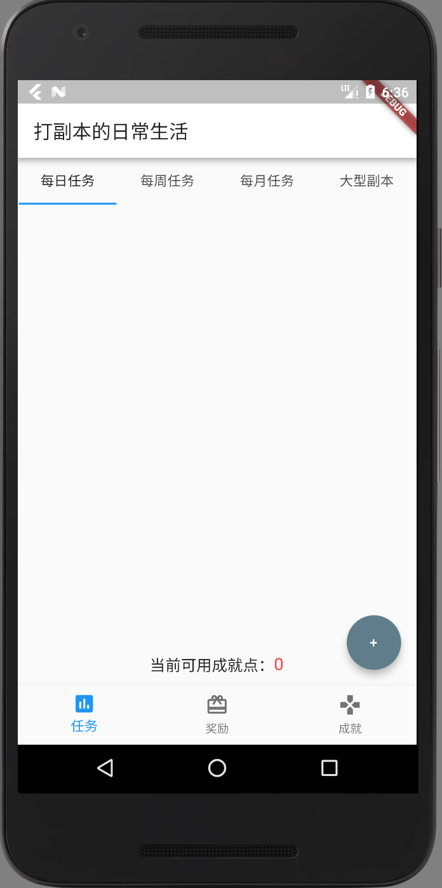

# Life with Instance

A life manager application developed with Flutter. 

## Dependency

- Flutter: https://flutter.io/
- Dart 2: https://www.dartlang.org/

## Usage

```shell
git clone https://github.com/yuwenhuisama/LifeWithInstance.git
cd LifeWithInstance
flutter build apk
```

## Route Map

- Local Storage
- Online Account
- Network Storage

## ScreenShot



## Contact

You are welcomed to make issues for this project !

Or contact with email: yuwenhuisama@outlook.com